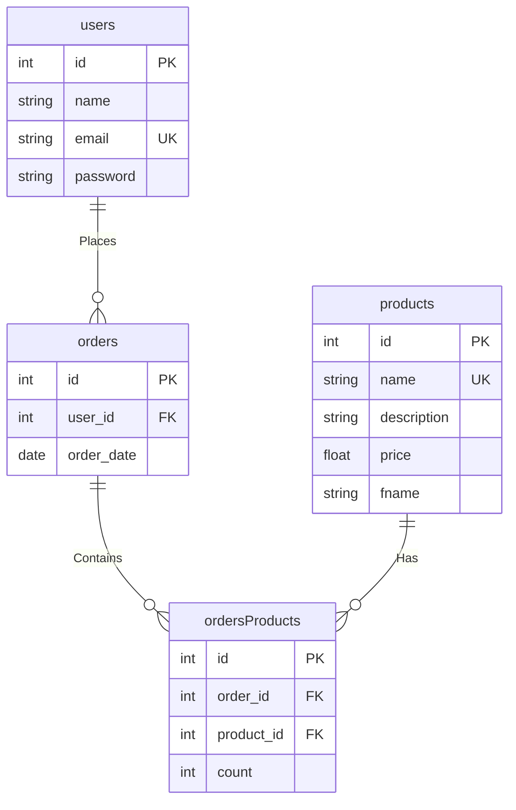

```mermaid
erDiagram
    users ||--o{ orders : Places
    users {
        int    id       PK
        string name
        string email    UK
        string password
    }    
    orders {
        int id      PK
        int user_id FK
        date order_date
    }
    products {
        int    id          PK
        string name        UK
        string description
        float price
        string fname
    }
    orders ||--o{ordersProducts: Contains
    products ||--o{ordersProducts: Has
    ordersProducts {
        int id         PK
        int order_id   FK
        int product_id FK
        int count
    }
```
